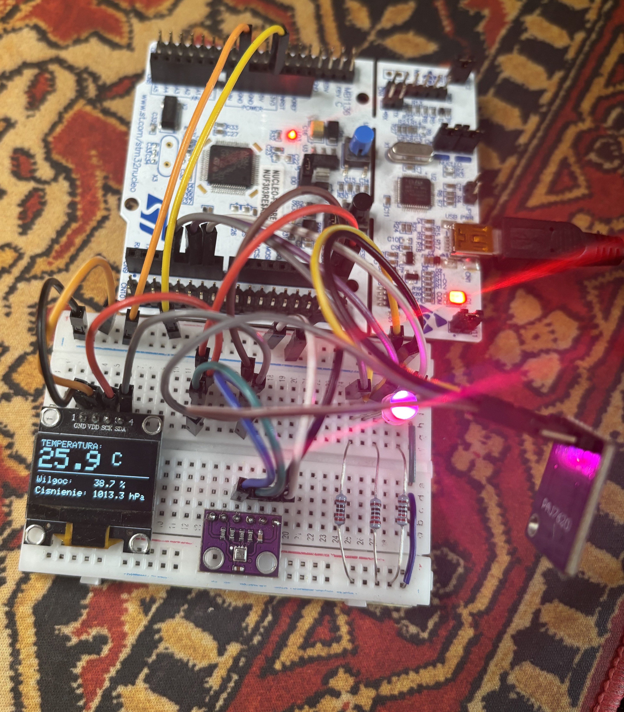

# STM32 BME280 Weather Station 🌤️

An interactive weather station built on **STM32 Nucleo** using C++/Arduino framework. The system measures environmental parameters, presents them on an OLED display, allows gesture navigation, and visualizes air comfort using an RGB LED with a dynamic breathing effect.

---

## 📸 Setup

---

## 📽️ Demo & Testing

Check out the weather station in action:

---

## 🌟 Key Features

* **Environmental Sensing:** Real-time measurement of Temperature, Humidity, Pressure, and Dew Point calculation.
* **RGB Comfort Indicator:** PWM-controlled RGB LED with a smooth "breathing" effect indicating temperature ranges and a visual alarm for high humidity (>65%).
* **Gesture Control:** Page navigation using the **PAJ7620** gesture sensor (Swipe Left/Right) with smooth scrolling transitions.
* **Button Navigation:** Fallback physical push-button navigation.
* **Real-Time Clock (RTC):** Displaying time and date (syncable via Serial input `T<timestamp>`).
* **Dynamic Weather Trends:** Visual indicators (`[+]`, `[-]`, `[=]`) showing 1-minute trends for temperature, pressure, and humidity.
* **Bouncing Screensaver:** OLED protection mechanism activating after 2 minutes of inactivity.

---

## 🛠️ Hardware Requirements

* **Microcontroller:** STM32 Nucleo (e.g., NUCLEO-F401RE / NUCLEO-L476RG)
* **Sensors & Modules:**
  * BME280 (I2C: `0x76`) — Temperature, Humidity, Pressure
  * PAJ7620 — Gesture Sensor
  * SSD1306 OLED Display 128x64 (I2C: `0x3C`)
* **Actuators & Components:**
  * RGB LED (Common Cathode/Anode connected to PWM pins)
  * On-board User Button (`USER_BTN`)

---

## 🔌 Pinout Mapping

| Component | Pin (STM32 Nucleo) | Interface / Notes |
| :--- | :--- | :--- |
| **BME280 / SSD1306 / PAJ7620** | SDA / SCL | I2C Bus |
| **RGB LED (Red)** | `D3` | PWM Output |
| **RGB LED (Green)** | `D5` | PWM Output |
| **RGB LED (Blue)** | `D6` | PWM Output |
| **Button** | `USER_BTN` | Digital Input |

---

## 📦 Required Libraries

Ensure you have the following libraries installed in Arduino IDE / PlatformIO:

* `Adafruit BME280 Library`
* `Adafruit SSD1306` & `Adafruit GFX Library`
* `Time` (TimeLib by Michael Margolis)
* `PAJ7620` (PAJ7620_UIGesture)

---

## 🚀 How to Run

1. Connect the hardware according to the pinout table.
2. Open `WeatherStation.ino` in Arduino IDE or VS Code (PlatformIO).
3. Select your STM32 Nucleo board target and compile.
4. **Time Sync:** Open Serial Monitor at `9600 baud` and send `T` followed by a Unix Timestamp (e.g., `T1700000000`) to set the current time.

---

## 👤 Author

* **Ignacy** — [GitHub Profile](https://github.com/ignaczy)

---

## 📄 License

This project is licensed under the MIT License — see the [LICENSE](LICENSE) file for details.